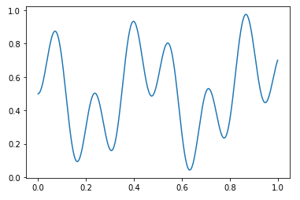
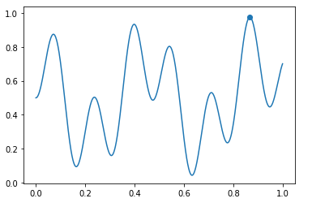

# MCTS
Monte Carlo Tree Search

# Example

## Find Maximum





```python
import MCTS
import numpy as np
from typing import List, Any


def f(x):
    return 0.5 * (np.sin(13 * x) * np.sin(27 * x) + 1)


class FuncEnv(MCTS.MCTSEnv):
    def initial_state(self):
        return (0.0, 0)

    def do_action(self, state: Any, action: int) -> Any:
        new_state = state[0] + action * 10 ** (state[1] - 1), state[1] - 1
        return new_state

    def is_terminal(self, state: Any) -> bool:
        return state[1] == -10

    def calc_terminate_value(self, state: Any) -> float:
        return f(state[0])

    def avaliable_actions(self, state: Any) -> List[int]:
        return list(range(10))


env = FuncEnv()
tree = MCTS.MCTSTree(env)
tree.search(10000)
print(tree.best_state, tree.best_value)

x = np.linspace(0, 1, 1000)
y = f(x)
plt.plot(x, y)
plt.scatter([tree.best_state[0]], [tree.best_value])
```

    ((0.8675281477, -10), 0.9755991429829118)


